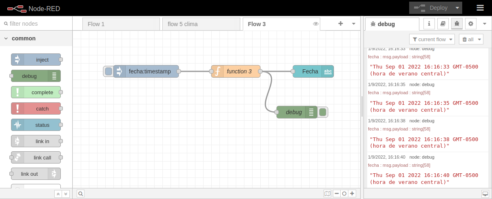
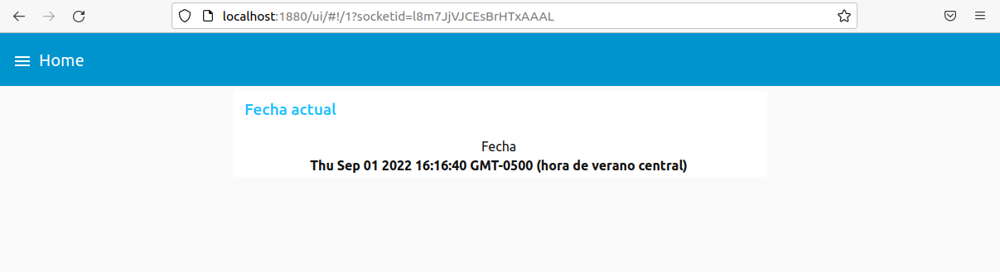

# flw2
Flow3-NodeRed

Este repositorio contiene los archivos correspondientes al Flow 3 del curso de NodeRed. Este curso se ve en los cursos y Diplomados de Internet de las Cosas de CodigoIoT y puedes consultar mas información en edu.codigoiot.com
Introducción

El flow 3 es el tercer ejercicio a realizar en el curso de NodeRed. Este ejercicio consiste en mostrar la fecha en un tablero con ayuda de los nodos node-red-dashboard.
Material Necesario

Para realizar este flow necesitas lo siguiente

    Ubuntu 20.04
    NodeJS
        NPM
        NodeRed
        Nodos Dashboard

Material de referencia

En los siguientes enlaces puedes encontrar cursos en la plataforma de edu.codigoiot.com que te permitirán realiar las configuraciones necesarias

    Instalación de Virutal Box y Ubuntu 20.04
    Instalación de NodeRed
    Introducción a NodeRed

Instrucciones
Requisitos previos

Para que este flow funcione, debes cumplir con los siguientes requisitos previos

    Instalación de NodeJS. Se recomienda tener instalado NodeJS en alguna versión LTS. Al momento de creación de este documento, se usó la versión 16.17.0LTS. Esta instalación debe incluir las Build-Tools para hacer uso de NPM
    Instalación de NodeRed. La instalación se realiza por NPM. Al momento de la creación de este contenido, se usó la versión 3.0.2
    Instalar los nodos node-red-dashboard. Para ello, dirigete a la opcion "Manage Palet" de NodeRed y en la pestaña Install busca node-red-dashboard. Finalmente haz clic en instalar.

Instrucciones de preparación del entorno

Para ejecutar este flow, es necesario lo siguiente

    Arrancar NodeRed con el comando node-red
    Importar el flow del repositorio
    Hacer clic en el boton Deploy

Instrucciones de operación

Para observar el resutlado de este flow, abre un navegador y dirígete a localhost:1880/ui
Resultados

